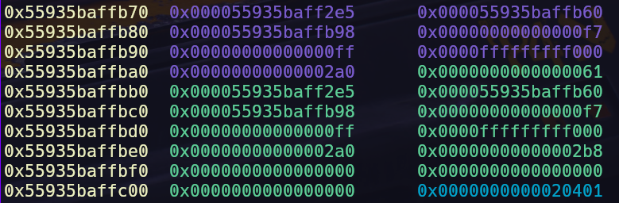
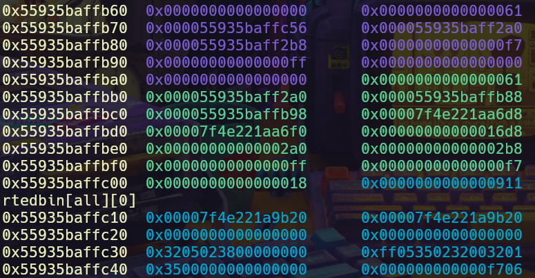
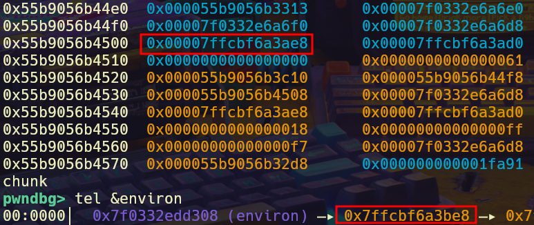
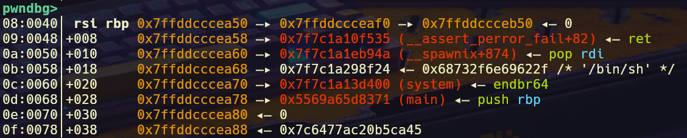

## Introduction
This was my first time making a challenge for **bi0sCTF**. I didn't really have a whole lot of experience solving VM challenges before this so I figured I'd learn how VMs work and make a challenge about it.

## Challenge Description

`Just cooked up a simple VM, forgot to check for bugs tho.`

Handout Files:
- _vm_chall_
- _Dockerfile_
- _libc.so.6_
- _ld-linux-x86-64.so.2_
- _flag.txt_

## Initial Analysis

The binary has all protections enabled and the libc is the latest version, 2.41.

```bash
Arch:       amd64-64-little
RELRO:      Full RELRO
Stack:      Canary found
NX:         NX enabled
PIE:        PIE enabled
Stripped:   No
```

```bash
GNU C Library (GNU libc) stable release version 2.41.
Compiled by GNU CC version 15.1.1 20250425.
```

We are given an unstripped binary without debug symbols. There are only 2 important functions: `main` and `expand`. We can look at `expand` once we figure out how `main` works.

## Reversing

### Structs

The `main` function starts by allocating memory using `calloc` for what appears to be 2 structs. We can name these as `st_1` and `st_2` until we know more.

```c
  init(argc, argv, envp);
  v52 = 0;
  len = 257;
  dest = 0LL;
  src = 0LL;
  buf = calloc(0x900uLL, 1uLL);
  v56 = calloc(0x58uLL, 1uLL);
```

`st_2`'s members are initialised with values that point to the end of `st_1`. The first member of `st_2` may be our VM's PC as we can see in the later section of the code that it is used to make decisions depending on the bytecode.

```c
  st_2[2] = st_1 + 0x8F8;
  st_2[1] = st_2[2];
  *st_2 = st_1;
  printf("[ lEn? ] >> ");
  __isoc23_scanf("%hd", &len);
  len = len;
  printf("[ BYTECODE ] >>");
  read(0, st_1, len);
  while ( *st_2 < (st_1 + len) )
```

We can define a struct that fits our assumptions of the structure. The first member is the `pc` pointer. The second member points to the end of the first struct and the third is a copy of the second, probably meant for iteration. That's 3 members however the struct still has `0x40` bytes of space left, we can assume this is used for storing other values and leave it defined as a continuous array to fit the size of the struct. We get the following struct.

```c
struct track
{
  char *pc;
  __int64 *mem_ptr;
  __int64 *mem_end;
  char store[64];
};
```

The VM appears to use `st_1` to keep track of where the bytecode is stored. 

```c
struct bytec
{
  char *code_mem[2304];
};
```

Now we get to the interpreter, the first opcode we see appears to set the `pc` value to whatever is the value of the next byte after the opcode. This must be a `JMP` instruction. We can conclude that the byte `0x45` will advance `pc` by whatever value the byte following opcode happens to be.

The next condition accounts for what has to happen if the opcode value was beyond `0x45`. The `expand` function is called and the user is prompted for the length and bytecode. This part appears to reset the VM stack and registers.

```c
}  else
  {
    v54 = expand(&st_2, &st_1);
    if ( v54 == 1 )
    {
perror("CALLOC FAIL");
      return 1;
    }
    printf("[ lEn? ] >> ");
    __isoc23_scanf("%hd", &len);
    len = len;
    printf("[ BYTECODE ] >>");
    read(0, st_1, len);
```

In the next instruction we see that, the `store` member of `st_1` is accessed using operand 1 of the opcode (which is the next byte). Considering that it is indexed by 8 each time, we can update the definition of store to `__int64 store[0x40]`. `store` appears to be the set of registers for the VM so we can change `store` to `regs`.

Now we can look at the instructions that operate on other parts of memory, starting with `case 0x31`. We see that `st_1->mem_ptr` keeps getting updated each time the opcode executes. It also assigns the value of operand 1 to the decremented `mem_ptr`. This appears to be a `PUSH` instruction. There also appear to be several unique variables with the same parameters being used for each opcode. We can remap all of these to a single variable name to clean up the decompilation.

The working of the `PUSH` instruction also allows us to infer that the first 2 members of the `st_1` struct are the `sp` and `bp` of the VM stack. The VM stack also grows from the bottom of the chunk to the top, therefore just like the actual function stack from higher to lower memory addresses. 

```c
struct track
{
  char *pc;
  __int64 *sp;
  __int64 *bp;
  __int64 *regs[64];
};
```

In the next opcode, we seem to have a call to `memcpy`. This segment of the code also refers to a certain location in `st_2->code_mem`. This area has been referred to in multiple checks for other opcodes as well. Let's assume this is storing data rather than being used directly in operations. It is also dereferenced as an `__int64 *`. We can redefine the struct as follows.

```c
struct bytec
{
  char code_mem[256];
  __int64 data_mem[256];
};
```

### Opcodes

Since we've deconstructed the `track` struct, we can skip ahead and see that the VM has the following opcodes that operate exclusively on the `st_2` registers:
- `SUB`
- `ADD`
- `SHL`
- `SHR`
- `NOT`
- `XOR`
- `OR`
- `AND`
- `MOV`

```c
      switch ( opc )
      {
        case 0x44:                              // SUB
          r8_1 = *++reg->pc & 7;
          reg->regs[r8_1] = (reg->regs[r8_1] - reg->regs[*++reg->pc & 7]);
          ++reg->pc;
          break;
        case 0x43:                              // ADD
          r8_1 = *++reg->pc & 7;
          reg->regs[r8_1] = (reg->regs[r8_1] + reg->regs[*++reg->pc & 7]);
          ++reg->pc;
          break;
        case 0x42:                              // SHL
          r8_1 = *++reg->pc & 7;
          reg->regs[r8_1] = (reg->regs[r8_1] << reg->regs[*++reg->pc & 7]);
          ++reg->pc;
          break;
        case 0x41:                              // SHR
          r8_1 = *++reg->pc & 7;
          reg->regs[r8_1] = (reg->regs[r8_1] >> reg->regs[*++reg->pc & 7]);
          ++reg->pc;
          break;
        case 0x40:                              // NOT
          ++reg->pc;
          reg->regs[*reg->pc & 7] = ~reg->regs[*reg->pc & 7];
          ++reg->pc;
          break;
        case 0x39:                              // XOR
          r8_1 = *++reg->pc & 7;
          reg->regs[r8_1] = (reg->regs[r8_1] ^ reg->regs[*++reg->pc & 7]);
          ++reg->pc;
          break;
        case 0x34:                              // MOV
          r8_1 = *++reg->pc & 7;
          reg->regs[r8_1] = reg->regs[*++reg->pc & 7];
          ++reg->pc;
          break;
```

Once the `bytec` struct is applied to `st_2`,` we can see that the rest of the operations have become easy to understand, and we get the following operations:
- `CPY`
- `MOV_R_X`
- `POP_R`
- `PUSH`
- `PUSH_R`
- `JMP`

```c
        case 0x36:                          // CPY
          mem = (mem + 256);
          dest = mem + 8 * reg->regs[*++reg->pc & 7];
          mem = (mem + 256);
          src = mem + 8 * reg->regs[*++reg->pc & 7];
          r8_1 = *++reg->pc - 1;
          reg->pc += 2;
          memcpy(dest, src, r8_1);
          break;
        case 0x35:                          // MOV_R_X
          r8_1 = *++reg->pc & 7;
          reg->regs[r8_1] = *++reg->pc;
          reg->pc += 8;
          break;
        case 0x33:                          // POP_R
          if ( reg->bp >= reg->sp )
          {
            r8_1 = *++reg->pc & 7;
            reg->regs[r8_1] = *++reg->sp;
            ++reg->pc;
          }
          break;
        case 0x31:                          // PUSH
          if ( reg->sp >= mem->data_mem )
          {
            op = *++reg->pc;
            sp = reg->sp;
            reg->sp = sp - 1;
            *sp = op;
            ++reg->pc;
          }
          break;
        case 0x32:                          // PUSH_R
          if ( reg->sp >= mem->data_mem )
          {
            r8_1 = *++reg->pc & 7;
            sp = reg->sp;
            reg->sp = sp - 1;
            *sp = reg->regs[r8_1];
            ++reg->pc;
          }
          break;
```

Going back to the opcode using the `memcpy`, we can see that operand 1 and 2 specify the index in `st_1->data_mem` to copy from and to. Operand 3 specifies the number of bytes to be copied. We can also rename the structs `st_1` to `mem` and `st_2` to `regs`.

Now that we've retrieved the structs, the `expand` function is easier to read. We can see that the function copies the data from the existing `mem` and `regs` structs into newly allocated buffers after freeing the old chunks. The function is called only when the interpreter cannot execute any recognisable opcodes.

```c
__int64 __fastcall expand(bytec *mem, regs *reg)
{
  char *new_mem; // [rsp+18h] [rbp-18h]
  _QWORD *new_reg; // [rsp+20h] [rbp-10h]

  new_mem = calloc(0x900uLL, 1uLL);
  new_reg = calloc(0x58uLL, 1uLL);
  if ( new_mem == -1LL || new_reg == -1LL )
  {
    perror("CALLOC FAIL");
    return 1LL;
  }
  else
  {
    memcpy(new_mem + 256, reg->pc + 256, 0x800uLL);
    memcpy(new_reg, *mem->code_mem, 0x58uLL);
    new_reg[2] = new_mem + 2296;
    new_reg[1] = *(*mem->code_mem + 8LL) - *(*mem->code_mem + 16LL) + new_reg[2];
    *new_reg = new_mem;
    free(reg->pc);
    free(*mem->code_mem);
    reg->pc = new_mem;
    *mem->code_mem = new_reg;
    return 0LL;
  }
}
```

## Exploitation

### Vulnerability

The bug lies within the `CPY` opcode. There are no conditions to check whether a given size for the `memcpy`'s third argument causes the copy to go out of bounds of the `mem->data_mem`. If we give the destination index to be the **beginning** of the VM stack, we can copy up to 256 bytes from or to the outside of the chunk.

---

Note: The VM stack has been implemented to grow from higher to lower addresses. This means any new items pushed onto the VM stack appear at the bottom of the chunk. 

---

We can use the out-of-bounds copy to copy the `regs` struct onto the VM stack where we can operate on it. This allows us to modify the register values and copy it back to the `regs` struct, which provides us with control over the `regs` struct.


_regs struct right below the vm stack_

### Overwriting the `regs` struct

We have no way to print out information to `stdout`. We can, however, copy the values from the register struct to the VM stack, modify them using the VM operations and copy them back to the register struct. Having control over the register struct allows us to control the values of the VM stack `bp`, `sp` and `pc`. This allows us to write or read using the stack operations anywhere we can get an address to. 

Currently we need a way to write to the actual function stack, we can do so by leaking the value of `environ`. To do so we will need a libc address somewhere on the stack since we can only copy to and from the VM stack and the register struct.

This is where the `expand` function comes in, `expand` frees the current VM memory and register structs, which leaves an unsorted bin pointer on the old stack. This gives us 4 chunks to play with, the old memory and register struct and the newly allocated memory and register struct.

There are 2 ways to obtain the libc leak:

1) You can copy the register struct to the VM stack and modify the `bp` and `sp` register values to point around the forward and next pointers of the old chunk. Note that we will need to store the address values into one of the VM registers so that we can use it for later. I used this approach in my exploit.

2) The second approach, which is easier, is to trigger the `expand` function twice, which will restore our current stack and register struct to the intial chunks. This would allow us to copy the forward and head pointers directly into the VM stack, as the free list pointers of the old stack and libc would be right below the current register struct.

---
Note: you need to pre-expand the stack such that you can pop the values you copied onto the stack into the registers. You may also want to set the `sp` register to point to the value you wish to pop directly into the registers.

---


_unsorted bin pointers of the old mem struct right below the regs struct_

### Getting a stack leak

Using the obtained libc address, we can use any combination of the other opcodes to modify the addresses to our liking. I used the `AND` operation to get the address without its lower 3 bits and `ADD` to offset the address. Once we're done modifying the `bp` and `sp` address to where we want them and setting up the stack appropriately to modify the registers we want, we can copy it back to the register struct to change the VM stack.


_environ pointer copied to the stack_

We can directly pop the `environ` address into one of the registers for later usage.

### Overwriting the return address

Now that we've obtained libc and stack addresses in one of the registers we can migrate the VM stack over the function stack and overwrite the return address with a one-gadget or ROP chain. Make sure the VM `sp` points right below the return address if you're using a one-gadget. We will be using the VM `PUSH` opcode to push our payload onto the main stack.


_rop chain pushed onto the stack_

## Conclusion

This challenge was initially meant to be slightly more difficult to exploit, however, I changed my idea once I noticed the current bug since the exploitation of the previously intended bug didn't seem very feasible. There are a few other bugs in the other opcodes which I let remain since they didn't seem to provide any useful primitives. I hope I can pull off a harder and more interesting challenge for the next bi0sCTF. 

Flag: `bi0sctf{1ni7ia1i53_Cr4p70_pWn_N3x7_5$67?!@&86}`

## Final Exploit

You can find the challenge sources and my exploit script [here](https://github.com/TheB4tMite/CTF-Writeups/tree/main/bi0sCTF_25)
